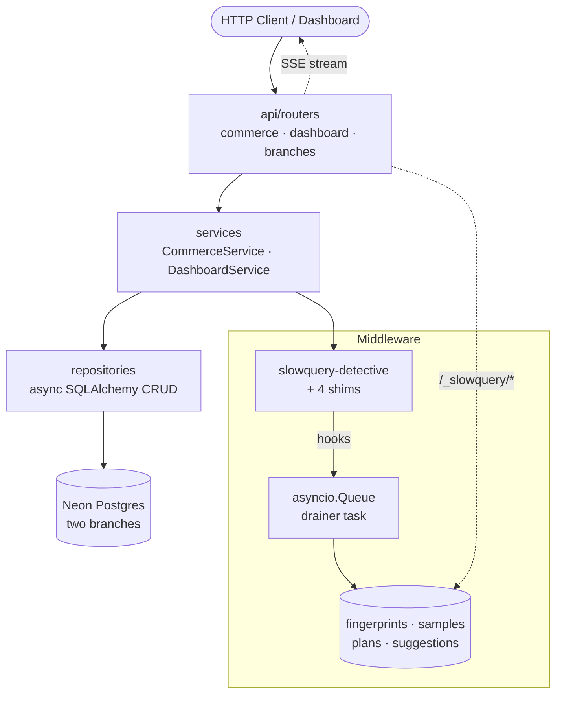
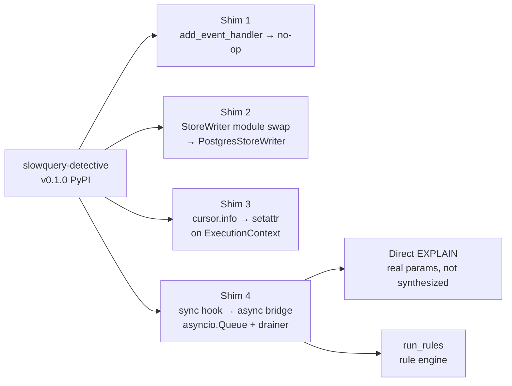
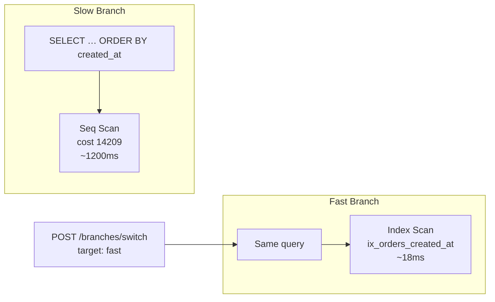

# 🔬 `slowquery-demo-backend`

> ⚡ **FastAPI demo service for the slowquery-detective observability pipeline.**
> Seeded commerce dataset, two Neon branches (slow vs fast), real EXPLAIN plans, and a live SSE stream — all on a public URL.

🌐 [Live API](https://slowquery-demo-backend.onrender.com) · 📖 [OpenAPI](https://slowquery-demo-backend.onrender.com/docs) · 📦 [slowquery-detective](https://pypi.org/project/slowquery-detective/) · 🖥️ [Dashboard](https://github.com/Abdul-Muizz1310/slowquery-dashboard-frontend) · 📐 [Specs](docs/specs/)


-6e9f18?style=flat-square)

[](https://github.com/Abdul-Muizz1310/slowquery-demo-backend/actions/workflows/ci.yml)


---

```console
$ curl https://slowquery-demo-backend.onrender.com/_slowquery/queries | jq '.[:2]'
[
  {"fingerprint":"c168fc78","calls":6,"p95_ms":2041,
   "sql":"SELECT … FROM orders ORDER BY created_at DESC LIMIT $1",
   "suggestions":["CREATE INDEX ix_orders_created_at ON orders(created_at)"]},
  {"fingerprint":"a3e9b11d","calls":4,"p95_ms":1847,
   "sql":"SELECT … FROM orders WHERE user_id = $1",
   "suggestions":["CREATE INDEX ix_orders_user_id ON orders(user_id)"]}
]

$ python -m scripts.traffic_generator --burst 60
fingerprints=7  samples=22  plans=7  suggestions=5
top: c168fc78  calls=6  p95=2041ms  rule=sort_without_index
```

---

## 🎯 Why this exists

Phase 4b of the [slowquery-detective](https://pypi.org/project/slowquery-detective/) portfolio project. The PyPI middleware captures slow queries, but it needs a **live target** — a real service with real slow queries running on a public URL.

This backend is that target: a seeded commerce database with intentionally missing indexes, wired to the middleware, producing real fingerprints, EXPLAIN plans, and rule-engine suggestions that the [dashboard frontend](https://github.com/Abdul-Muizz1310/slowquery-dashboard-frontend) visualizes.

The demo's punchline: switch from the `slowquery` branch (no indexes, seq scans) to `slowquery-fast` (3 indexes) and watch p95 drop from **1200ms to 18ms**.

---

## ✨ Features

- 🛒 Seeded commerce dataset — users, products, orders, order_items (100k+ rows)
- 🔀 Two Neon branches: `slowquery` (no indexes, seq scans) and `slowquery-fast` (3 indexes)
- 🔍 slowquery-detective middleware installed with 4 compatibility shims
- 📊 Dashboard API at `/_slowquery/*` — fingerprints, samples, plans, suggestions
- 📡 SSE stream for live p95 updates to the frontend
- 🔀 Branch switch endpoint — swap slow ↔ fast in one POST
- 🚦 Traffic generator script for burst testing
- 🧪 213 unit + 49 integration tests (Testcontainers), 100% line coverage
- 🛡️ Pydantic v2 schemas, `Literal` types, frozen DTOs
- 🚀 Render free tier with auto-deploy via CI webhook

---

## 🏗️ System architecture



### 🔧 Shim architecture



### 🔀 Two-branch demo flow



---

## 🗂️ Project structure

```
src/slowquery_demo/
├── main.py                      # FastAPI app factory, middleware, CORS, lifespan
├── api/
│   └── routers/
│       ├── commerce.py          # /users, /products, /orders (trigger slow queries)
│       ├── dashboard.py         # /_slowquery/queries, /_slowquery/stream (SSE)
│       └── branches.py          # /branches/switch, /branches/current
├── services/
│   ├── commerce.py              # CommerceService — commerce query logic
│   ├── dashboard.py             # DashboardService — fingerprint aggregation
│   └── store.py                 # PostgresStoreWriter — shim 2 target
├── repositories/
│   ├── commerce.py              # Users, products, orders CRUD
│   └── dashboard.py             # Fingerprints, samples, plans, suggestions
├── models/
│   └── *.py                     # SQLAlchemy 2.0 async models (8 tables)
├── schemas/
│   └── *.py                     # Pydantic v2 DTOs (frozen, Literal-typed)
├── core/
│   ├── config.py                # pydantic-settings from .env
│   ├── db.py                    # async engine + sessionmaker
│   └── observability.py         # 4 library shims + drainer task
└── migrations/
    └── versions/
        └── 0001_initial.py      # Full 8-table schema
```

---

## 🌐 API surface

| Method | Endpoint | Purpose |
|---|---|---|
| `GET` | `/health` | Liveness + service identity |
| `GET` | `/version` | Build version |
| `GET` | `/users?limit=N` | Seeded users (triggers slow query) |
| `GET` | `/users/{id}/orders` | Seq scan on `orders.user_id` (slow branch) |
| `GET` | `/orders?limit=N` | `ORDER BY created_at` — fires `sort_without_index` rule |
| `GET` | `/products?limit=N` | Seeded products |
| `GET` | `/_slowquery/queries` | Dashboard API — live fingerprint list with suggestions |
| `GET` | `/_slowquery/stream` | 📡 SSE — live p95 updates per fingerprint |
| `POST` | `/branches/switch` | Switch between `slow` and `fast` Neon branch |
| `GET` | `/branches/current` | Current active branch |
| `GET` | `/docs` | OpenAPI UI |

---

## 🛠️ Stack

| Concern | Choice |
|---|---|
| **Language** | Python 3.12 (uv for everything, no pip) |
| **Framework** | FastAPI + SQLAlchemy 2.0 async + asyncpg |
| **Middleware** | [`slowquery-detective`](https://pypi.org/project/slowquery-detective/) v0.1.0 (with 4 in-repo compatibility shims) |
| **Database** | Neon serverless Postgres, two branches (`slowquery` / `slowquery-fast`) |
| **Migrations** | Alembic async env, one migration (`0001_initial.py`) — full 8-table schema |
| **Tests** | pytest + pytest-asyncio, 213 unit + 49 integration (Testcontainers), 100% coverage |
| **Lint / Types** | ruff + mypy `--strict` on `src/` |
| **Hosting** | Render Free tier, auto-deploy via deploy-hook webhook from CI |
| **CI** | GitHub Actions: lint → test → build → deploy |

---

## 🚀 Run locally

```bash
# 1. clone & env
git clone https://github.com/Abdul-Muizz1310/slowquery-demo-backend.git
cd slowquery-demo-backend
uv sync --all-extras
cp .env.example .env
# fill in Neon + OpenRouter secrets

# 2. migrate & seed
DATABASE_URL=postgresql://.../neondb?sslmode=require \
  uv run alembic upgrade head
DATABASE_URL=postgresql://.../neondb?sslmode=require \
  uv run python -m scripts.seed_slow --reset \
    --users 1000 --products 200 --orders 100000 --order-items 500000

# 3. serve
uv run uvicorn slowquery_demo.main:app --reload
# → http://localhost:8000/health
# → http://localhost:8000/_slowquery/queries
```

### 🚦 Traffic generator

```bash
uv run python -m scripts.traffic_generator --burst 60
# 60-second burst → populates fingerprints, samples, plans, suggestions
```

---

## 🧪 Testing

```bash
uv run pytest                                     # full suite
uv run pytest -m "not slow and not integration"   # fast-only (CI)
uv run pytest --cov=src/slowquery_demo --cov-report=term-missing
```

| Metric | Value |
|---|---|
| **Unit tests** | 213 |
| **Integration tests** | 49 (Testcontainers) |
| **Line coverage** | **100%** |
| **Methodology** | Red-first spec-TDD. Every spec in `docs/specs/` with enumerated test cases before code ships. |

---

## 📐 Engineering philosophy

| Principle | How it shows up |
|---|---|
| 🧪 **Spec-TDD** | Every feature slice has a spec in `docs/specs/` with enumerated test cases before code ships. |
| 🛡️ **Negative-space programming** | Typed domain errors (`UserNotFoundError`, `ConfigError`), `Literal` types for branch targets, frozen Pydantic DTOs. |
| 🏗️ **MVC layering** | `routers → services → repositories → models`. Controllers never touch SQLAlchemy; repos are the only layer that imports it. |
| 🔤 **Typed everything** | `mypy --strict` clean. Pydantic v2 DTOs, typed SQLAlchemy models, no `Any`. |
| 🌊 **Pure core, imperative shell** | Business logic stays unit-testable; DB/HTTP side effects live at the edges. |
| 🎯 **One responsibility per module** | Every file describes exactly one thing — never "and". |

---

## 🚀 Deploy

Render free tier via [`render.yaml`](render.yaml). CI fires a deploy-hook webhook on green builds.

1. Render dashboard → **New → Blueprint** → connect this repo
2. Fill env vars in service settings
3. Copy the Deploy Hook URL → `gh secret set RENDER_DEPLOY_HOOK --body '<url>'`
4. Push to `main` → CI lint/test/build → CI fires hook → Render rebuilds

---

## 📄 License

MIT. See [LICENSE](LICENSE).

---

> 🔬 **`slowquery-demo --help`** · seeded queries, real EXPLAIN plans, two branches
