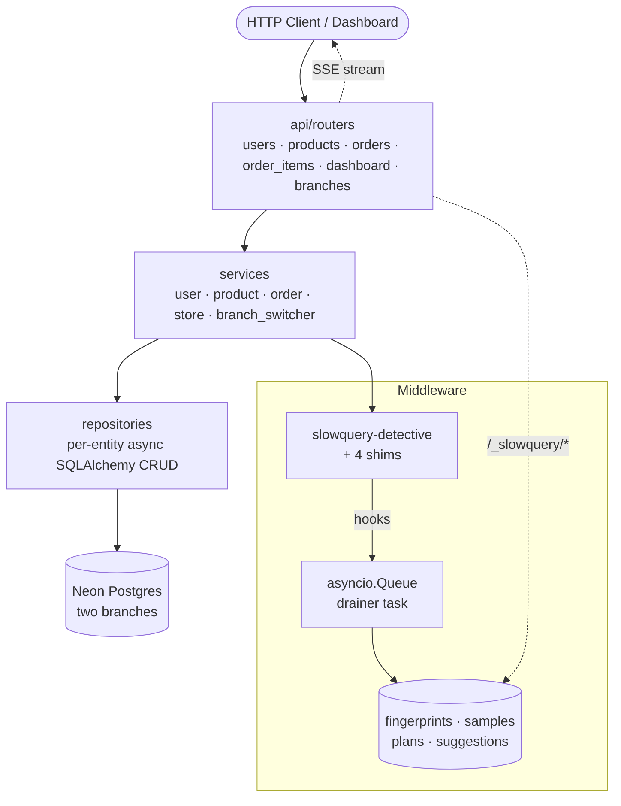
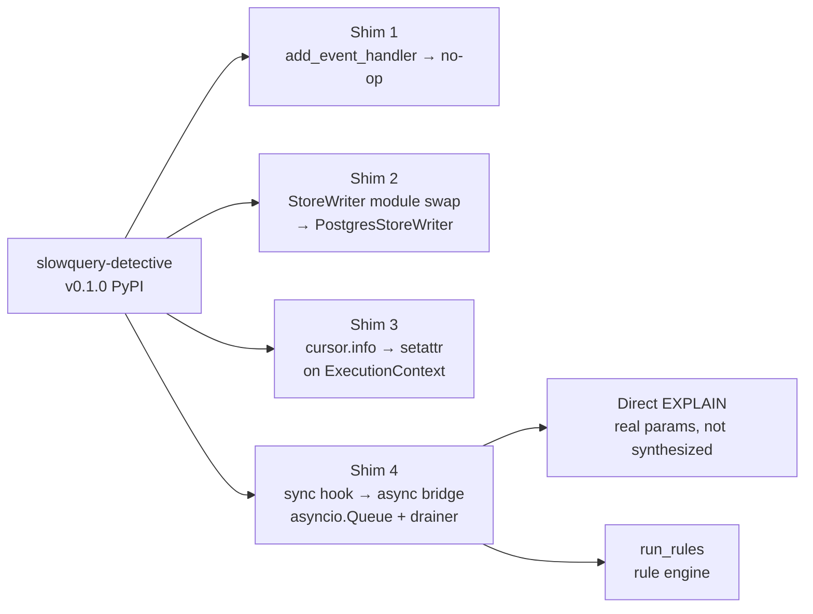
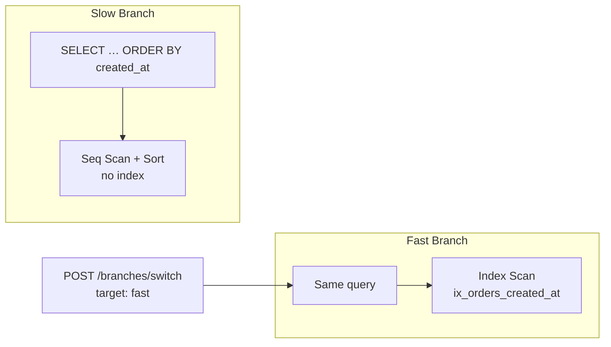

# 🔬 `slowquery-demo-backend`

> ⚡ **FastAPI demo service for the slowquery-detective observability pipeline.**
> Seeded commerce dataset, two Neon branches (slow vs fast), real EXPLAIN plans, and a live SSE stream — all on a public URL.

🌐 [Live API](https://slowquery-demo-backend.onrender.com) · 📖 [OpenAPI](https://slowquery-demo-backend.onrender.com/docs) · 📦 [slowquery-detective](https://pypi.org/project/slowquery-detective/) · 🖥️ [Dashboard](https://github.com/Abdul-Muizz1310/slowquery-dashboard-frontend) · 📐 [Specs](docs/specs/)


-6e9f18?style=flat-square)

[](https://github.com/Abdul-Muizz1310/slowquery-demo-backend/actions/workflows/ci.yml)


---

One captured fingerprint from the live service — verbatim, `suggestions` trimmed to its first entry. It is a snapshot taken 2026-08-02; the counters and percentiles move as traffic flows, so re-running the command will not reproduce these exact numbers.

```console
$ curl -s https://slowquery-demo-backend.onrender.com/_slowquery/queries \
    | jq 'map(select(.suggestions | length > 0)) | .[0] | .suggestions |= .[:1]'
{
  "id": "7f9c44d378fe11e2",
  "fingerprint": "select orders.id, orders.user_id, orders.status, orders.total_cents, orders.created_at from orders where orders.user_id = cast(? as uuid) order by orders.created_at desc, orders.id desc limit cast(? as int)",
  "first_seen": "2026-04-11T20:18:10.850418Z",
  "last_seen": "2026-08-02T01:57:01.532134Z",
  "call_count": 211,
  "total_ms": 34301,
  "p50_ms": 8.57240660116076,
  "p95_ms": 10.6789851561189,
  "p99_ms": 20.7338997162878,
  "max_ms": 110.0723072886467,
  "suggestions": [
    {
      "id": 2,
      "fingerprint_id": "7f9c44d378fe11e2",
      "kind": "index",
      "source": "rules",
      "rule": null,
      "sql": "CREATE INDEX IF NOT EXISTS ix_orders_created_at ON orders(created_at);",
      "rationale": "Sort node on ORDER BY created_at with significant cost; an index ending with created_at would let the planner skip the sort step.",
      "applied_at": null
    }
  ]
}
```

`fingerprint` is the canonical SQL; `id` is the 16-char hash. The full DTO is [`schemas/slowquery.py`](src/slowquery_demo/schemas/slowquery.py) — there is no `calls` or `sql` field on a fingerprint, and `rule` is `null` today (the rule name is not recovered from the rationale; use `source`).

Drive traffic into it:

```console
$ uv run python -m scripts.traffic_generator \
    --host https://slowquery-demo-backend.onrender.com --duration 60 --users 3 --json
{"total": 36, "failures": 0, "p95_ms": 14062.000000005355, "exit_code": 0}
```

Those are real numbers from a real 60-second run against the live URL on 2026-08-02; `p95_ms` is wall-clock from a laptop over the Render → Neon round-trip, and the process exits non-zero if p95 crosses 30 s or the failure rate crosses 20 % (that tripwire is the point — see [DEMO.md](docs/DEMO.md)).

---

## 🎯 Why this exists

Phase 4b of the [slowquery-detective](https://pypi.org/project/slowquery-detective/) portfolio project. The PyPI middleware captures slow queries, but it needs a **live target** — a real service with real slow queries running on a public URL.

This backend is that target: a seeded commerce database with intentionally missing indexes, wired to the middleware, producing real fingerprints, EXPLAIN plans, and rule-engine suggestions that the [dashboard frontend](https://github.com/Abdul-Muizz1310/slowquery-dashboard-frontend) visualizes.

The demo's punchline: switch from the `slowquery` branch (no indexes, seq scans) to `slowquery-fast` (indexed) and the seq-scan / sort queries become index scans. The size of the p95 drop is **seed-dependent** — the full 1M-order seed produces a large, dramatic delta; the documented 100k-order seed shows a smaller one (see [DEVIATIONS §1 / §4](docs/DEVIATIONS.md)). Measure it yourself with [`benchmarks/bench_demo_latency.py`](benchmarks/bench_demo_latency.py) rather than trusting a number in a README.

---

## ✨ Features

- 🛒 Seeded commerce dataset — users, products, orders, order_items (100k+ rows)
- 🔀 Two Neon branches: `slowquery` (no indexes, seq scans) and `slowquery-fast` (4 indexes)
- 🔍 slowquery-detective middleware installed with 4 compatibility shims
- 📊 Dashboard API at `/_slowquery/*` — fingerprints, samples, plans, suggestions
- 📡 SSE stream for live p95 updates to the frontend
- 🔀 Branch switch endpoint — swap slow ↔ fast in one POST, plus a read-only `/branches/current`
- 🙈 Self-instrumentation filter — the pipeline never fingerprints its own bookkeeping reads or `/health`
- 🚦 Traffic generator script for burst testing
- 🧪 221 unit + 49 integration tests (Testcontainers), 87% unit-lane line coverage
- 🛡️ Pydantic v2 schemas, `Literal` types, frozen DTOs
- 🚀 Render free tier — Render's GitHub integration auto-deploys `main` on push (no CI deploy hook)

---

## 🏗️ System architecture


```mermaid
flowchart TD
    Client([HTTP Client / Dashboard]) --> Routers[api/routers<br/>users · products · orders · order_items · dashboard · branches]
    Routers --> Services[services<br/>user · product · order · store · branch_switcher]
    Services --> Repos[repositories<br/>per-entity async SQLAlchemy CRUD]
    Repos --> Neon[(Neon Postgres<br/>two branches)]

    subgraph Middleware
        MW[slowquery-detective<br/>+ 4 shims] -->|hooks| Queue[asyncio.Queue<br/>drainer task]
        Queue --> Bookkeeping[(fingerprints · samples<br/>plans · suggestions)]
    end

    Routers -.->|/_slowquery/*| Bookkeeping
    Routers -.->|SSE stream| Client
    Services --> MW
```

### 🔧 Shim architecture


```mermaid
flowchart LR
    Library[slowquery-detective<br/>v0.1.0 PyPI] --> S1[Shim 1<br/>add_event_handler → no-op]
    Library --> S2[Shim 2<br/>StoreWriter module swap<br/>→ PostgresStoreWriter]
    Library --> S3[Shim 3<br/>cursor.info → setattr<br/>on ExecutionContext]
    Library --> S4[Shim 4<br/>sync hook → async bridge<br/>asyncio.Queue + drainer]
    S4 --> EXPLAIN[Direct EXPLAIN<br/>real params, not synthesized]
    S4 --> Rules[run_rules<br/>rule engine]
```

### 🔀 Two-branch demo flow


```mermaid
flowchart LR
    subgraph Slow Branch
        SlowQ[SELECT … ORDER BY created_at] --> SeqScan[Seq Scan + Sort<br/>no index]
    end
    subgraph Fast Branch
        FastQ[Same query] --> IdxScan[Index Scan<br/>ix_orders_created_at]
    end
    Switch[POST /branches/switch<br/>target: fast] --> FastQ
```

> The exact cost / latency numbers depend on seed size and the Neon compute tier, so they are not asserted here. Run [`benchmarks/bench_demo_latency.py`](benchmarks/bench_demo_latency.py) against your own seeded branches to get real figures.

---

## 🗂️ Project structure

```
src/slowquery_demo/
├── main.py                        # FastAPI app factory, middleware, lifespan
├── api/
│   └── routers/
│       ├── users.py               # /users, /users/{id}/orders
│       ├── products.py            # /products
│       ├── orders.py              # /orders (fires sort_without_index rule)
│       ├── order_items.py         # /order_items
│       ├── dashboard.py           # /_slowquery/* (queries, detail, force-explain, SSE)
│       └── branches.py            # /branches/switch, /branches/current
├── services/
│   ├── user_service.py            # user query logic
│   ├── product_service.py         # product query logic
│   ├── order_service.py           # order / order-item query logic
│   ├── store.py                   # PostgresStoreWriter — shim 2 target
│   ├── store_errors.py            # StoreWriterError
│   └── branch_switcher.py         # branch-swap business logic
├── repositories/                  # per-entity async SQLAlchemy CRUD (sole SQLAlchemy importers)
│   ├── user_repository.py
│   ├── product_repository.py
│   ├── order_repository.py
│   ├── order_item_repository.py
│   └── slowquery_repository.py    # fingerprints, samples, plans, suggestions
├── models/                        # SQLAlchemy 2.0 async models
│   ├── base.py                    # DeclarativeBase
│   ├── user.py · product.py · order.py · order_item.py
│   └── slowquery_store.py         # 4 bookkeeping tables
├── schemas/                       # Pydantic v2 DTOs (frozen, Literal-typed)
│   └── user.py · product.py · order.py · pagination.py · branches.py · slowquery.py
└── core/
    ├── config.py                  # pydantic-settings from .env
    ├── database.py                # async engine + sessionmaker (pool_pre_ping, recycle)
    ├── db_config.py               # asyncpg URL normalisation
    ├── branch_state.py            # .branch_state load/save (survives restarts)
    ├── access.py                  # mutation cooldown + admin-token gates
    ├── platform.py                # CORS, /health, /version, /metrics, / → /docs
    ├── platform_token.py          # X-Platform-Token (async key fetch + claims)
    ├── errors.py                  # typed DomainError → HTTP mapping
    └── observability.py           # 4 library shims + ignore list + drainer task

alembic/versions/0001_initial.py   # full 8-table schema (commerce + bookkeeping)
scripts/                           # seed_slow · seed_fast · traffic_generator · smoke_health
```

---

## 🌐 API surface

| Method | Endpoint | Purpose |
|---|---|---|
| `GET` | `/health` | Liveness + service identity |
| `GET` | `/version` | Build version |
| `GET` | `/users?limit=N` | Seeded users (triggers slow query) |
| `GET` | `/users/{id}/orders` | Seq scan on `orders.user_id` (slow branch) |
| `GET` | `/orders?limit=N` | `ORDER BY created_at` — fires `sort_without_index` rule |
| `GET` | `/products?limit=N` | Seeded products |
| `GET` | `/_slowquery/queries` | Dashboard API — live fingerprint list with suggestions |
| `GET` | `/_slowquery/queries/{id}` | Full detail for one fingerprint (plan, samples, suggestions) |
| `POST` | `/_slowquery/queries/{id}/force-explain` | 🔒 Re-analyze (gated: requires `DEMO_MUTATION_TOKEN` even in demo mode) |
| `GET` | `/_slowquery/api/stream` | 📡 SSE — live p95 updates per fingerprint |
| `POST` | `/branches/switch` | Switch between `slow` and `fast` Neon branch (per-client cooldown) |
| `GET` | `/branches/current` | Active branch — read-only, ungated, pollable |
| `GET` | `/docs` | OpenAPI UI (`/` redirects here) |

> 🔒 The two state-mutating endpoints (`force-explain`, `branches/switch`) are hardened for the public URL: a per-client cooldown (`DEMO_MUTATION_COOLDOWN_S`) throttles both even under `DEMO_MODE`, and the destructive `force-explain` fails closed unless `DEMO_MUTATION_TOKEN` is set. See [DEVIATIONS](docs/DEVIATIONS.md).

---

## 🛠️ Stack

| Concern | Choice |
|---|---|
| **Language** | Python 3.12 (uv for everything, no pip) |
| **Framework** | FastAPI + SQLAlchemy 2.0 async + asyncpg |
| **Middleware** | [`slowquery-detective`](https://pypi.org/project/slowquery-detective/) v0.1.0 (with 4 in-repo compatibility shims) |
| **Database** | Neon serverless Postgres, two branches (`slowquery` / `slowquery-fast`) |
| **Migrations** | Alembic async env, one migration (`0001_initial.py`) — full 8-table schema |
| **Tests** | pytest + pytest-asyncio, 221 unit + 49 integration (Testcontainers), 87% unit-lane coverage |
| **Lint / Types** | ruff + mypy `--strict` on `src/` |
| **Hosting** | Render Free tier — Render's own GitHub integration deploys `main` on push |
| **CI** | GitHub Actions: lint → test (+ per-module coverage floors) → build → smoke (post-deploy `/health`, skipped unless `SMOKE_BASE_URL` is set) |

---

## 🚀 Run locally

```bash
# 1. clone & env
git clone https://github.com/Abdul-Muizz1310/slowquery-demo-backend.git
cd slowquery-demo-backend
uv sync --all-extras
cp .env.example .env
# fill in Neon + OpenRouter secrets

# 2. migrate & seed
DATABASE_URL=postgresql://.../neondb?sslmode=require \
  uv run alembic upgrade head
DATABASE_URL=postgresql://.../neondb?sslmode=require \
  uv run python -m scripts.seed_slow --reset \
    --users 1000 --products 200 --orders 100000 --order-items 500000

# 3. serve
uv run uvicorn slowquery_demo.main:app --reload
# → http://localhost:8000/health
# → http://localhost:8000/_slowquery/queries
```

### 🚦 Traffic generator

```bash
# Against the local server started above (the default --host):
uv run python -m scripts.traffic_generator --duration 60 --users 3 --json
# {"total": 36, "failures": 0, "p95_ms": 14062.000000005355, "exit_code": 0}
#   ^ shape of the output; the numbers above are from a real run against the
#     live Render URL, so a local run against a fast Postgres will differ.
```

Flags: `--host` (default `http://localhost:8000`), `--duration` (seconds, default 60), `--users` (default 20, sets the inter-request pacing), `--json` (print the summary line). The run populates fingerprints, samples, plans and suggestions, and exits non-zero if p95 > 30 000 ms or the failure rate > 20 % so a broken demo shows up as a red cron run on Render.

---

## 🧪 Testing

```bash
uv run pytest                                     # full suite
uv run pytest -m "not slow and not integration"   # fast-only (CI)
uv run pytest --cov=src/slowquery_demo --cov-report=term-missing
```

| Metric | Value |
|---|---|
| **Unit tests** | 221 (unit lane, `-m "not slow and not integration"`) |
| **Integration tests** | 49 (Testcontainers) |
| **Line coverage** | **87%** (unit lane, `--cov-fail-under=80`) |
| **Methodology** | Red-first spec-TDD. Specs `00`–`10` and `12` in `docs/specs/` enumerate their test cases before the code ships. **Spec `11` (mutation gating) is the one exception**: the code landed first in response to an audit and the spec was reconstructed from it afterwards — [it says so at the top](docs/specs/11-mutation-gating.md). |

> **Honesty note:** every test now lives in a numbered `test_NN_*.py` file, each case carrying the `docs/specs/` case it verifies. Assertions are on behaviour, not on source text — the three surviving file-content greps are the documented [no-index guards](docs/ARCHITECTURE.md), and the traffic generator's endpoint-scope tests (one of which was satisfied by a dead constant planted in the script) now drive its real request loop under `respx`. The earlier standalone `*_coverage.py` files — an after-the-fact, line-targeting coverage pass that asserted mock-call counts and reached into private attributes — have been removed. The two largest (`test_full_coverage.py` + `test_final_coverage.py`, ~1.7k lines) and the six smaller ones (`{dashboard,pagination,repositories,router,services,store_writer}_coverage.py`, ~0.7k lines) were deleted; their behaviourally meaningful cases (typed-error wrapping in the store, `clamp_limit`/cursor round-trips, the fingerprint-id validator, repository/service DTO mapping) were folded into the matching numbered spec files, and the pure line-padding cases were dropped. The suite is now spec-first end to end.

---

## 📐 Engineering philosophy

| Principle | How it shows up |
|---|---|
| 🧪 **Spec-TDD** | Every feature slice has a spec in `docs/specs/` with enumerated test cases before code ships. |
| 🛡️ **Negative-space programming** | Typed domain errors (`UserNotFoundError`, `ConfigError`), `Literal` types for branch targets, frozen Pydantic DTOs. |
| 🏗️ **MVC layering** | `routers → services → repositories → models`. Controllers never touch SQLAlchemy; repos are the only layer that imports it. |
| 🔤 **Typed everything** | `mypy --strict` clean. Pydantic v2 DTOs, typed SQLAlchemy models, no `Any`. |
| 🌊 **Pure core, imperative shell** | Business logic stays unit-testable; DB/HTTP side effects live at the edges. |
| 🎯 **One responsibility per module** | Every file describes exactly one thing — never "and". |

---

## 🚀 Deploy

Render free tier via [`render.yaml`](render.yaml). Render's GitHub integration watches `main`, so **pushing is the deploy** — CI does not fire a deploy hook and there is no `RENDER_DEPLOY_HOOK` secret ([DEVIATIONS §11](docs/DEVIATIONS.md)).

1. Render dashboard → **New → Blueprint** → connect this repo
2. Fill env vars in service settings (`DATABASE_URL`, `DATABASE_URL_FAST`, `SLOWQUERY_STORE_URL`; optionally `DEMO_MUTATION_TOKEN` to enable `force-explain`)
3. Push to `main` → Render rebuilds; CI runs lint → test → build in parallel
4. *Optional:* set a `SMOKE_BASE_URL` repository variable to the service URL and CI's `smoke` job will poll the deployed `/health` after the build. Leave it unset and the job skips (spec 12) — nothing to break.

---

## 📄 License

MIT. See [LICENSE](LICENSE).

---

> 🔬 **`slowquery-demo --help`** · seeded queries, real EXPLAIN plans, two branches
