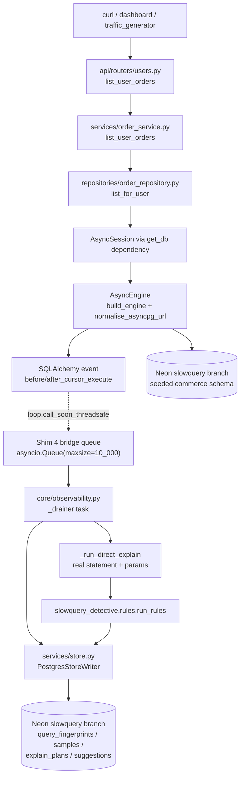
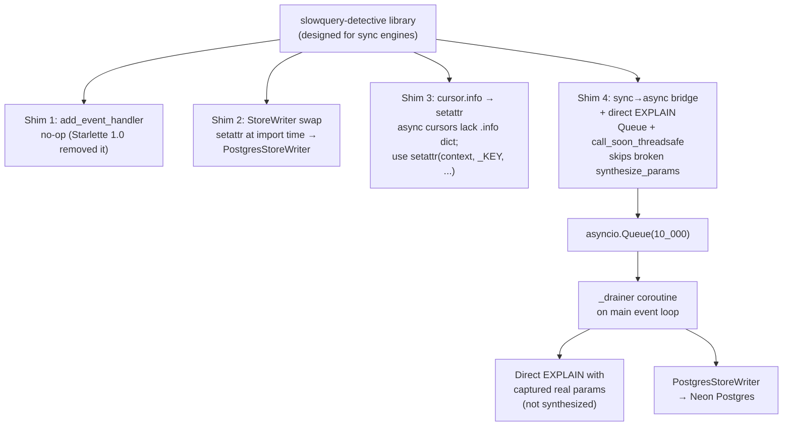
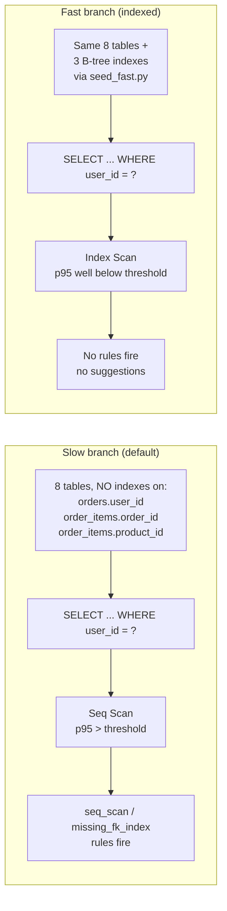
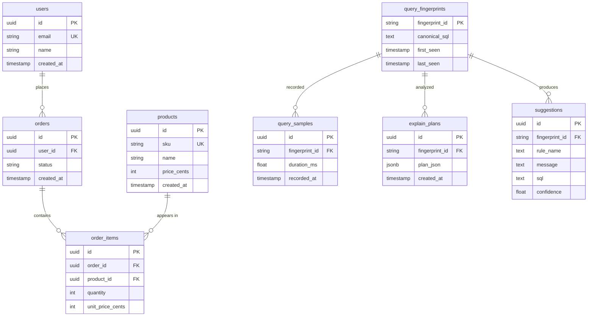
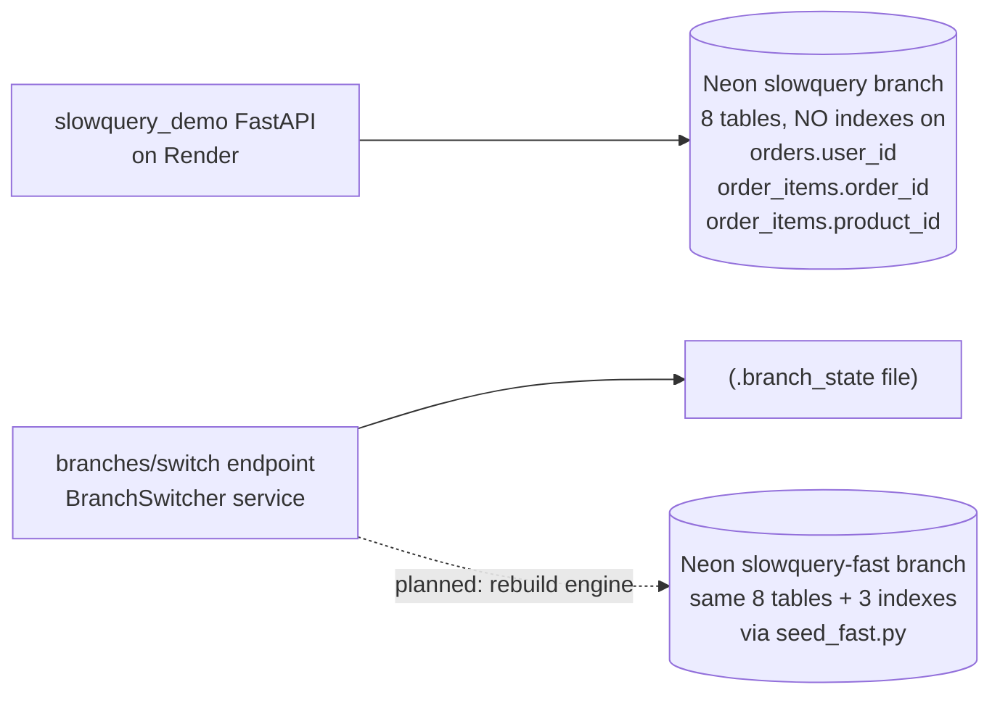

# Architecture

## Strict MVC layering

```
api/routers     →   HTTP surface (FastAPI; thin; no SQLAlchemy imports)
services/       →   business logic (pure; raises typed DomainError subclasses)
repositories/   →   async SQLAlchemy select()/text() — the ONLY layer that imports SQLAlchemy
models/         →   SQLAlchemy 2.0 DeclarativeBase ORM classes
schemas/        →   Pydantic v2 DTOs + PaginatedResponse[T]
core/           →   config (Settings), database (engine + session factory),
                     errors (DomainError + exception handlers), observability
                     (the four library shims + drainer), platform (health, CORS)
```

Controllers never touch the DB. Models never know about HTTP. Pure core, imperative shell.

## Data plane (the route `/users/{id}/orders` takes)



The dashed arrow from `Hook` to `Bridge` is the only cross-loop boundary: SQLAlchemy events fire in sync context (even for async engines), and we dispatch to the FastAPI event loop via `loop.call_soon_threadsafe`. Everything downstream of the bridge is pure async on the main loop.

## Shim architecture

The demo backend bridges the `slowquery-detective` library to a real async engine via four compatibility shims in `core/observability.py`. This is the key technical achievement of this repo -- the library was designed for sync engines, and these shims make it work transparently with asyncpg.



## Two-branch demo

The demo showcases the library's value by contrasting a branch with no indexes (slow) against a branch with indexes (fast). This makes the seq scan / missing index rules fire reliably.



## Database schema

All 8 tables live in a single Neon branch, created by one hand-written Alembic migration (`0001_initial.py`).



The first four tables are the commerce domain (seeded with fake data). The last four are the `slowquery-detective` bookkeeping tables, written by `PostgresStoreWriter`. A no-index guard test greps the migration file and fails CI if any future change adds an index on the three demo-critical columns (`orders.user_id`, `order_items.order_id`, `order_items.product_id`).

## Two Neon branches



The branch-switch code path exists (request body validation, asyncio.Lock, state persistence) but does not yet rebuild the SQLAlchemy engine at runtime against the fast URL -- see [DEVIATIONS.md](DEVIATIONS.md).

## Key endpoints

| Surface | Purpose | Slow-path trigger |
|---|---|---|
| `/health` | Liveness probe (platform middleware) | -- |
| `/version` | Build identity | -- |
| `/_slowquery/queries` | Dashboard API -- returns the fingerprint list | -- |
| `/users`, `/products` | Fast reads (unique indexes on email / sku) | -- |
| `/orders?limit=N` | Recent orders, `ORDER BY created_at DESC` | **sort_without_index** rule |
| `/users/{id}/orders` | Orders for one user | Seq Scan on `orders.user_id` |
| `/orders/{id}` | Order + its items (join to `order_items`) | Seq Scan on `order_items.order_id` |
| `/order_items?product_id=...` | Items for one product | Seq Scan on `order_items.product_id` |
| `/branches/switch` | Swap active branch state (full engine rebuild deferred) | -- |

## The four library compatibility shims

See [`core/observability.py`](../src/slowquery_demo/core/observability.py) for the implementation; each shim is documented inline. Summary:

1. `add_event_handler` -> no-op (Starlette 1.0 removed it).
2. `StoreWriter` swapped at import time via `setattr(_sqd_middleware, "StoreWriter", PostgresStoreWriter)`.
3. `cursor.info[_KEY]` -> `setattr(context, _KEY, ...)` in the hook (async cursors and asyncpg contexts both lack `.info`).
4. Sync-hook to async-store bridge + direct EXPLAIN using real captured statement + parameters, skipping the library's broken `synthesize_params`.

## Migration path

Alembic async env reads `DATABASE_URL` via `slowquery_demo.core.db_config.get_database_url()` which runs the URL through `normalise_asyncpg_url()` so libpq-style `sslmode` / `channel_binding` params don't break asyncpg.

One migration: [`alembic/versions/0001_initial.py`](../alembic/versions/0001_initial.py) -- hand-written DDL for all 8 tables + the `order_status` enum. The no-index guard test ([`tests/unit/test_00_schema.py::test_migration_does_not_create_forbidden_indexes`](../tests/unit/test_00_schema.py)) greps this file and fails the build if any future change adds an index on the three demo-critical columns.

On Render Free tier, `render.yaml`'s `preDeployCommand: alembic upgrade head` is [silently ignored](RENDER_FREE_TIER_MIGRATIONS.md), so the first migration ran manually from a dev machine. Subsequent migrations will move into the Dockerfile `CMD` when schema churn picks up.
