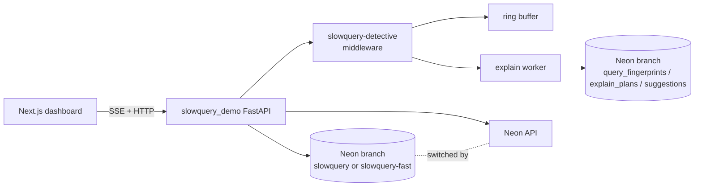

# Architecture

> Fully drawn in S2 after specs land. This file is a stub so the repo layout stays honest in S1.

## Layering

```
api/routers    → HTTP surface (FastAPI)
services/      → business logic (pure)
repositories/  → async SQLAlchemy data access
models/        → SQLAlchemy ORM classes
schemas/       → Pydantic v2 DTOs
core/          → config, platform middleware, logging
```

Controllers never touch the DB. Models never know about HTTP. Pure core, imperative shell.

## Data plane



## Key endpoints

| Surface | Purpose |
|---|---|
| `/health`, `/version` | platform middleware liveness |
| `/users`, `/products`, `/orders`, `/order_items` | demo REST endpoints (seed the traffic) |
| `/_slowquery/queries`, `/_slowquery/stream`, ... | slowquery-detective dashboard API (mounted from the library) |
| `/branches/switch` | swap active Neon branch between `slowquery` and `slowquery-fast` |
