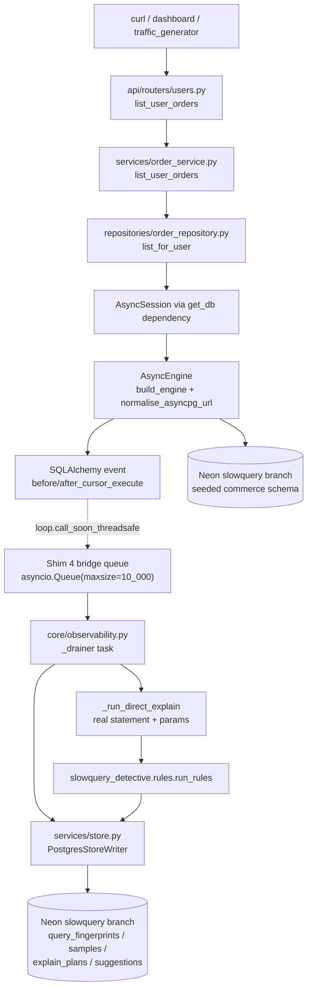
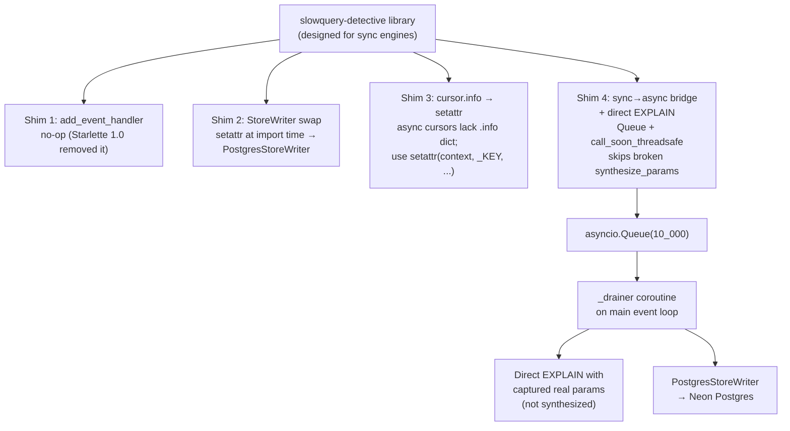
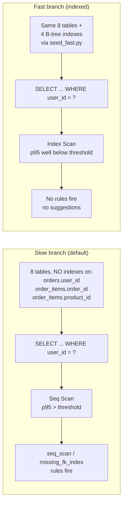
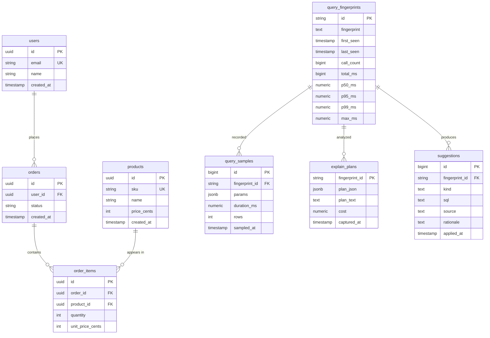
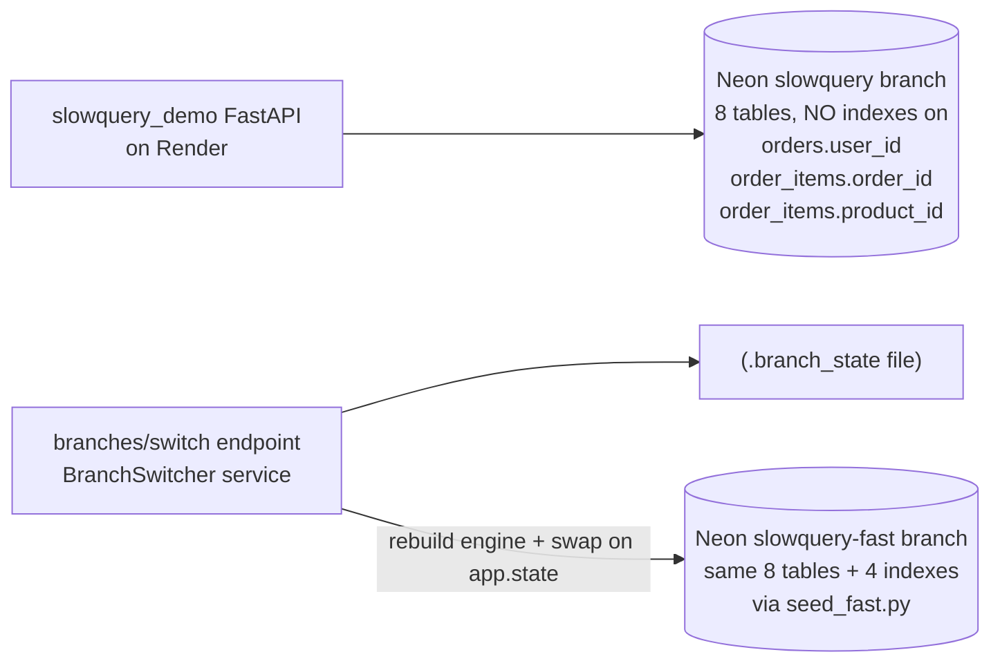

# Architecture

## Strict MVC layering

```
api/routers     →   HTTP surface (FastAPI; thin; no SQLAlchemy imports)
services/       →   business logic (pure; raises typed DomainError subclasses)
repositories/   →   async SQLAlchemy select()/text() — the ONLY layer that imports SQLAlchemy
models/         →   SQLAlchemy 2.0 DeclarativeBase ORM classes
schemas/        →   Pydantic v2 DTOs + PaginatedResponse[T]
core/           →   config (Settings), database (engine + session factory),
                     db_config (asyncpg URL normalisation), branch_state
                     (.branch_state persistence), access (mutation cooldown +
                     admin-token gates), errors (DomainError + exception
                     handlers), observability (the four library shims, the
                     self-instrumentation ignore list, and the drainer),
                     platform (health, version, metrics, CORS), platform_token
                     (X-Platform-Token verification)
```

Controllers never touch the DB. Models never know about HTTP. Pure core, imperative shell.

## Data plane (the route `/users/{id}/orders` takes)


```mermaid
flowchart TD
    Client["curl / dashboard / traffic_generator"]
    Router["api/routers/users.py<br/>list_user_orders"]
    Service["services/order_service.py<br/>list_user_orders"]
    Repo["repositories/order_repository.py<br/>list_for_user"]
    Session["AsyncSession via get_db dependency"]
    Engine["AsyncEngine<br/>build_engine + normalise_asyncpg_url"]
    Hook["SQLAlchemy event<br/>before/after_cursor_execute"]
    Neon1[("Neon slowquery branch<br/>seeded commerce schema")]

    Bridge["Shim 4 bridge queue<br/>asyncio.Queue(maxsize=10_000)"]
    Drainer["core/observability.py<br/>_drainer task"]
    StoreWriter["services/store.py<br/>PostgresStoreWriter"]
    DirectExplain["_run_direct_explain<br/>real statement + params"]
    Rules["slowquery_detective.rules.run_rules"]
    Neon2[("Neon slowquery branch<br/>query_fingerprints / samples /<br/>explain_plans / suggestions")]

    Client --> Router
    Router --> Service
    Service --> Repo
    Repo --> Session
    Session --> Engine
    Engine --> Hook
    Engine --> Neon1
    Hook -. "loop.call_soon_threadsafe" .-> Bridge
    Bridge --> Drainer
    Drainer --> StoreWriter
    Drainer --> DirectExplain
    DirectExplain --> Rules
    Rules --> StoreWriter
    StoreWriter --> Neon2
```

The dashed arrow from `Hook` to `Bridge` is the only cross-loop boundary: SQLAlchemy events fire in sync context (even for async engines), and we dispatch to the FastAPI event loop via `loop.call_soon_threadsafe`. Everything downstream of the bridge is pure async on the main loop.

## Shim architecture

The demo backend bridges the `slowquery-detective` library to a real async engine via four compatibility shims in `core/observability.py`. This is the key technical achievement of this repo -- the library was designed for sync engines, and these shims make it work transparently with asyncpg.


```mermaid
flowchart TD
    Library["slowquery-detective library<br/>(designed for sync engines)"]

    S1["Shim 1: add_event_handler<br/>no-op (Starlette 1.0 removed it)"]
    S2["Shim 2: StoreWriter swap<br/>setattr at import time →<br/>PostgresStoreWriter"]
    S3["Shim 3: cursor.info → setattr<br/>async cursors lack .info dict;<br/>use setattr(context, _KEY, ...)"]
    S4["Shim 4: sync→async bridge<br/>+ direct EXPLAIN<br/>Queue + call_soon_threadsafe<br/>skips broken synthesize_params"]

    Library --> S1
    Library --> S2
    Library --> S3
    Library --> S4

    S4 --> Queue["asyncio.Queue(10_000)"]
    Queue --> Drainer["_drainer coroutine<br/>on main event loop"]
    Drainer --> RealExplain["Direct EXPLAIN with<br/>captured real params<br/>(not synthesized)"]
    Drainer --> Store["PostgresStoreWriter<br/>→ Neon Postgres"]
```

## Two-branch demo

The demo showcases the library's value by contrasting a branch with no indexes (slow) against a branch with indexes (fast). This makes the seq scan / missing index rules fire reliably.


```mermaid
flowchart LR
    subgraph slow["Slow branch (default)"]
        S_Tables["8 tables, NO indexes on:<br/>orders.user_id<br/>order_items.order_id<br/>order_items.product_id"]
        S_Query["SELECT ... WHERE user_id = ?"]
        S_Plan["Seq Scan<br/>p95 > threshold"]
        S_Rule["seq_scan / missing_fk_index<br/>rules fire"]
        S_Tables --> S_Query --> S_Plan --> S_Rule
    end

    subgraph fast["Fast branch (indexed)"]
        F_Tables["Same 8 tables +<br/>4 B-tree indexes<br/>via seed_fast.py"]
        F_Query["SELECT ... WHERE user_id = ?"]
        F_Plan["Index Scan<br/>p95 well below threshold"]
        F_None["No rules fire<br/>no suggestions"]
        F_Tables --> F_Query --> F_Plan --> F_None
    end
```

## Database schema

All 8 tables live in a single Neon branch, created by one hand-written Alembic migration (`0001_initial.py`).


```mermaid
erDiagram
    users {
        uuid id PK
        string email UK
        string name
        timestamp created_at
    }
    products {
        uuid id PK
        string sku UK
        string name
        int price_cents
        timestamp created_at
    }
    orders {
        uuid id PK
        uuid user_id FK
        string status
        timestamp created_at
    }
    order_items {
        uuid id PK
        uuid order_id FK
        uuid product_id FK
        int quantity
        int unit_price_cents
    }
    query_fingerprints {
        string id PK
        text fingerprint
        timestamp first_seen
        timestamp last_seen
        bigint call_count
        bigint total_ms
        numeric p50_ms
        numeric p95_ms
        numeric p99_ms
        numeric max_ms
    }
    query_samples {
        bigint id PK
        string fingerprint_id FK
        jsonb params
        numeric duration_ms
        int rows
        timestamp sampled_at
    }
    explain_plans {
        string fingerprint_id PK
        jsonb plan_json
        text plan_text
        numeric cost
        timestamp captured_at
    }
    suggestions {
        bigint id PK
        string fingerprint_id FK
        text kind
        text sql
        text source
        text rationale
        timestamp applied_at
    }

    users ||--o{ orders : "places"
    orders ||--o{ order_items : "contains"
    products ||--o{ order_items : "appears in"
    query_fingerprints ||--o{ query_samples : "recorded"
    query_fingerprints ||--o{ explain_plans : "analyzed"
    query_fingerprints ||--o{ suggestions : "produces"
```

The first four tables are the commerce domain (seeded with fake data). The last four are the `slowquery-detective` bookkeeping tables, written by `PostgresStoreWriter`; the bookkeeping columns above are the ones [`models/slowquery_store.py`](../src/slowquery_demo/models/slowquery_store.py) declares and [`schemas/slowquery.py`](../src/slowquery_demo/schemas/slowquery.py) serialises — the diagram is diffable against the models, not a sketch.

### Deliberate source-text guard tests

Three unit tests assert on *file contents* rather than behaviour. They are the exception, not the pattern, and each guards a negative that has no runtime surface to observe (the absence of DDL cannot be asserted from an API response):

| Test | Guards |
|---|---|
| [`test_00_schema.py::test_migration_does_not_create_forbidden_indexes`](../tests/unit/test_00_schema.py) | the Alembic migration never adds an index on `orders.user_id`, `order_items.order_id` or `order_items.product_id` — the demo's slow branch depends on their absence |
| [`test_02_seed_slow.py::test_script_body_has_no_create_index_statement`](../tests/unit/test_02_seed_slow.py) | `seed_slow.py` never issues `CREATE INDEX` |
| [`test_03_seed_fast.py::test_create_index_appears_only_in_fast_indexes_constant`](../tests/unit/test_03_seed_fast.py) | every `CREATE INDEX` in `seed_fast.py` is a reviewed entry of the `FAST_INDEXES` tuple — no stray index escapes PR review |

Everything else asserts behaviour. The traffic generator's endpoint-scope tests used to grep its source too (and one of them was satisfied by a dead `_GREP_MARKER_HEADLESS` constant planted for that purpose); they now drive the real request loop under `respx` — see [DEVIATIONS §10](DEVIATIONS.md).

## Two Neon branches


```mermaid
flowchart LR
    App["slowquery_demo FastAPI<br/>on Render"]
    Switch["branches/switch endpoint<br/>BranchSwitcher service"]
    BranchState["(.branch_state file)"]
    Slow[("Neon slowquery branch<br/>8 tables, NO indexes on<br/>orders.user_id<br/>order_items.order_id<br/>order_items.product_id")]
    Fast[("Neon slowquery-fast branch<br/>same 8 tables + 4 indexes<br/>via seed_fast.py")]

    App --> Slow
    Switch --> BranchState
    Switch -- "rebuild engine + swap on app.state" --> Fast
```

The branch-switch code path rebuilds the SQLAlchemy engine at runtime: it builds a new `AsyncEngine` against the target URL, health-checks it with `SELECT 1`, atomically swaps `app.state.engine` + `app.state.db_sessionmaker`, clears the rolling buffer, and re-attaches the slowquery listeners to the new engine. The one remaining gap is that the drainer's EXPLAIN pool does not yet repoint at the new branch -- see [DEVIATIONS.md §3](DEVIATIONS.md).

## Key endpoints

| Surface | Purpose | Slow-path trigger |
|---|---|---|
| `/health` | Liveness probe (platform middleware) | -- |
| `/version` | Build identity | -- |
| `/_slowquery/queries` | Dashboard API -- returns the fingerprint list | -- |
| `/_slowquery/queries/{id}` | One fingerprint: plan, samples, suggestions | -- |
| `/_slowquery/queries/{id}/force-explain` | Re-analyze (admin-token gated, fail-closed) | -- |
| `/_slowquery/api/stream` | SSE -- live p95 ticks + heartbeats | -- |
| `/users`, `/products` | Fast reads (unique indexes on email / sku) | -- |
| `/orders?limit=N` | Recent orders, `ORDER BY created_at DESC` | **sort_without_index** rule |
| `/users/{id}/orders` | Orders for one user | Seq Scan on `orders.user_id` |
| `/orders/{id}` | Order + its items (join to `order_items`) | Seq Scan on `order_items.order_id` |
| `/order_items?product_id=...` | Items for one product | Seq Scan on `order_items.product_id` |
| `/branches/switch` | Swap the active branch: rebuilds + swaps the `AsyncEngine`, clears the buffer, re-attaches the hooks (cooldown-throttled) | -- |
| `/branches/current` | Read the active branch (read-only, ungated) | -- |

The `/branches/switch` row used to read "full engine rebuild deferred". That is stale: the rebuild ships (see the paragraph above and [DEVIATIONS §3](DEVIATIONS.md)). The one part still deferred is repointing the drainer's EXPLAIN pool at the new branch.

Queries the observability pipeline issues against its own bookkeeping tables, plus `/health`'s `SELECT 1`, are filtered out of capture by `observability.should_ignore_statement` (spec 05 invariants 5-6) — otherwise the dashboard's own reads accumulate `total_ms` and climb to the top of `/_slowquery/queries`, burying the commerce slow queries the demo exists to show.

## The four library compatibility shims

See [`core/observability.py`](../src/slowquery_demo/core/observability.py) for the implementation; each shim is documented inline. Summary:

1. `add_event_handler` -> no-op (Starlette 1.0 removed it).
2. `StoreWriter` swapped at import time via `setattr(_sqd_middleware, "StoreWriter", PostgresStoreWriter)`.
3. `cursor.info[_KEY]` -> `setattr(context, _KEY, ...)` in the hook (async cursors and asyncpg contexts both lack `.info`).
4. Sync-hook to async-store bridge + direct EXPLAIN using real captured statement + parameters, skipping the library's broken `synthesize_params`.

The patched hook also owns the self-instrumentation filter (`should_ignore_statement`): the library's `install()` has no ignore-list parameter, so spec 05 invariants 5-6 are enforced here, in the `after_cursor_execute` listener, before either recording sink.

## Migration path

Alembic async env reads `DATABASE_URL` via `slowquery_demo.core.db_config.get_database_url()` which runs the URL through `normalise_asyncpg_url()` so libpq-style `sslmode` / `channel_binding` params don't break asyncpg.

One migration: [`alembic/versions/0001_initial.py`](../alembic/versions/0001_initial.py) -- hand-written DDL for all 8 tables + the `order_status` enum. The no-index guard test ([`tests/unit/test_00_schema.py::test_migration_does_not_create_forbidden_indexes`](../tests/unit/test_00_schema.py)) greps this file and fails the build if any future change adds an index on the three demo-critical columns.

On Render Free tier, `render.yaml`'s `preDeployCommand: alembic upgrade head` is [silently ignored](RENDER_FREE_TIER_MIGRATIONS.md), so the first migration ran manually from a dev machine. Subsequent migrations will move into the Dockerfile `CMD` when schema churn picks up.
